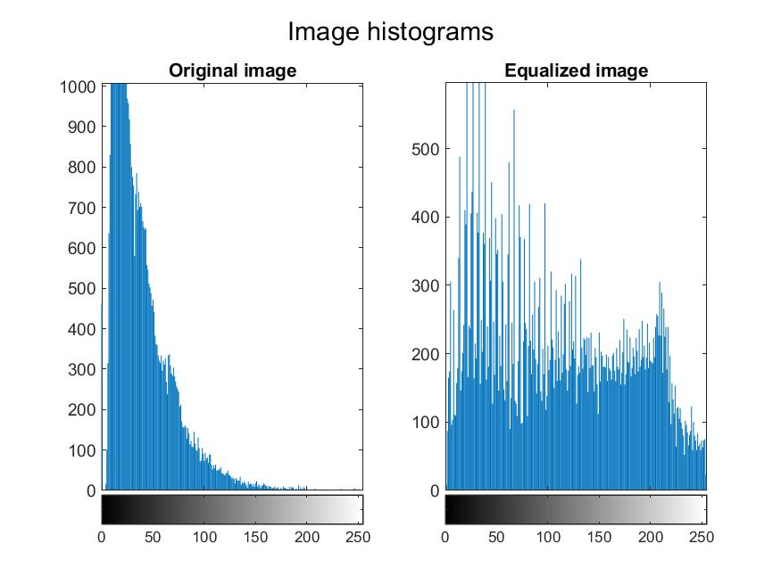
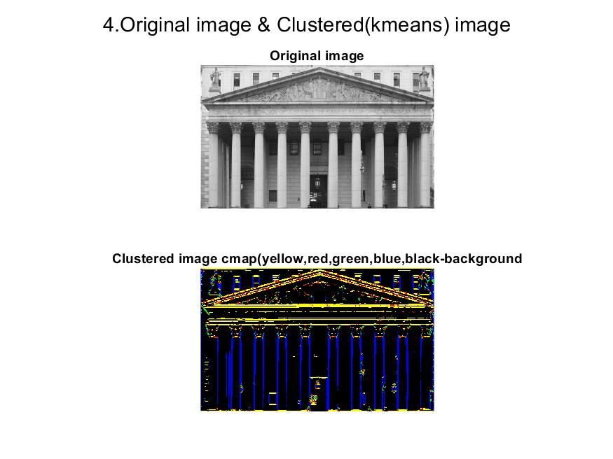

# Matlab-Problems

Image Analysis problems

## Task 01

This code performs image processing tasks on a set of images. It utilizes three resizing methods: nearest neighbor, nearest neighbor with antialiasing, and a combination of nearest neighbor with antialiasing followed by bicubic interpolation. The primary objective is to evaluate the quality of resizing by analyzing the differences in gradient and energy between the original and processed images. The code generates graphical representations illustrating the relationships between gradient *(G)* and energy *(E)* for each resizing method, along with linear regression approximations. The processed images are also displayed for visual inspection. The overall aim is to assess the trade-offs between different resizing methods in terms of image quality.

### Output Samples

## Task 02 

This code applies intensity transformations to a set of images. It loads pre-computed probability density functions for pixel values, parses images from a folder, and applies T1 and T2 intensity mappings using Gaussian and Rice probability density functions. The code also generates histograms, equalizes images, and applies Otsu thresholding. Results are displayed through plots showcasing the original image, transformed images, histograms, equalized images, and Otsu thresholded images. The objective is to examine the impact of intensity transformations on image enhancement.

### Output Samples

## Task 03 

This code applies various filters and binarization techniques to images. It starts by loading an image, creating a binary version, and then explores Gaussian blur with different sigma values and padding options. It also applies a 5x5 average filter and displays the original and resulting binary images. Lastly, Laplace filters with different sigma values are used, showcasing both the filtered images and their binarized versions. The code aims to illustrate the impact of different filters and binarization methods on image processing.

### Output Samples

## Task 04 

This code defines two filters, h and g, and visualizes them in the time domain. It then computes and displays their Fourier transforms, as well as the magnitude of the product of their transforms. Afterward, it applies these filters to an image and displays the results. Lastly, it performs clustering using k-means on the computed features and visualizes the original and clustered images.

### Output Samples

## Task 05 

This code analyzes images through Fourier transform, phase modification, quantization, and compression. It provides visualizations for FFT, explores phase modification effects, and evaluates image quality metrics after quantization and compression. The code aims to offer insights into image processing techniques in a concise and informative manner.

### Output

